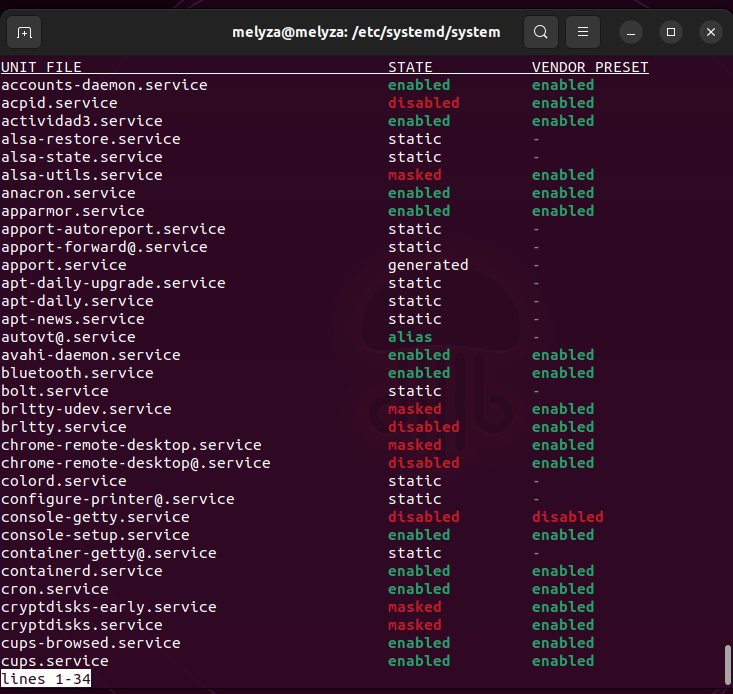

# Actividad 3

- Script de bash que imprime cada segundo un saludo y la fecha

```
#!/bin/bash
while true; do
echo "-------------------------------------"
fecha_actual=$(date +"%d/%m/%Y")
hora_actual=$(date +"%H:%M:%S")
echo "Hola $fecha_actual $hora_actual"
    sleep 1
done
```

- Archivo ***actividad3.service***
```
[Unit]
Description=Actividad3

[Service]
Type=simple
ExecStart="/home/melyza/Escritorio/scripts/actividad3.sh"

[Install]
WantedBy=default.target
```
El archivo se encuentra alojado en el siguiente directorio

``` /etc/systemd/system```


- Comandos utilizados

Para detectar los cambios realizados, es decir, el archivo que se ha creado. 

```
sudo systemctl daemon-reload
```

Para habilitar el servicio

```
sudo systemctl enable actividad3.service
```
Para iniciar el servicio 

```
sudo systemctl start actividad3.service
```

- Verificando informaciòn de los servicios

```
sudo systemctl list-unit-files --type service --all
```




Para ver el estado del servicio 

```
watch service actividad3 status
```


Para detener el servicio 

```
sudo service actividad3 stop
```


Ahora, procedo a reiniciar el sistema operativo para verificar que el servicio inicia automaticamente. 


