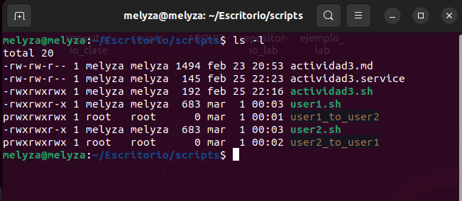
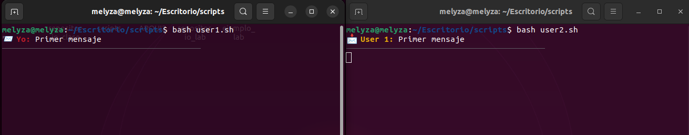
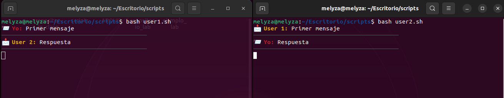
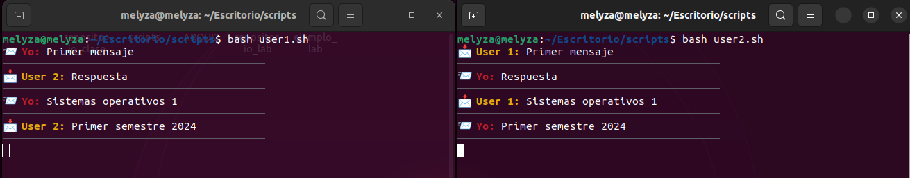

# Actividad 4

## Chat entre dos usuarios

Para crear los pipes se utilizan el comando ***mkfifo***

- Usuario 1 a Usuario 2

``` 
mkfifo user1_to_user2
 ```

- Usuario 2 a Usuario 1

``` 
mkfifo user2_to_user1
 ```



Archivo para Usuario 1 :

``` 
#!/bin/bash

recibir() {
    while true; do
        if read line < user2_to_user1; then
            echo -e "📩 \e[1;93mUser 2:\e[0m $line"
            echo -e "\e[90m──────────────────────────────────────────\e[0m"
        fi
    done
}

enviar() {
    while true; do
        read message
        echo -ne "\033[1A\033[K"
        echo -e "📨 \e[1;31mYo:\e[0m $message"
        echo "$message" > user1_to_user2
        echo -e "\e[90m──────────────────────────────────────────\e[0m"
    done
}

recibir &
enviar
 ```


Archivo para Usuario 2 :

```
#!/bin/bash

recibir() {
    while true; do
        if read line < user1_to_user2; then
            echo -e "📩 \e[1;93mUser 1:\e[0m $line"
            echo -e "\e[90m──────────────────────────────────────────\e[0m"
        fi
    done
}

enviar() {
    while true; do
        read message
        echo -ne "\033[1A\033[K"
        echo -e "📨 \e[1;31mYo:\e[0m $message"
        echo "$message" > user2_to_user1
        echo -e "\e[90m──────────────────────────────────────────\e[0m"
    done
}

recibir &
enviar
```


| Método | Descripción |
|--|--|
|enviar()| Está constantemente consultando el pipe del usuario contrario y lo imprime |
|enviar()| Lee un mensaje escrito por el usuario y lo envía al pipe |

## Funcionamiento






### Funcionamiento del chat


<p>El video del funcionamiento de la activdad se encuentra publicado en el siguiente enlace <a  href="https://www.youtube.com/watch?v=BCSscc9i8Ic">
https://www.youtube.com/watch?v=BCSscc9i8Ic
</a> </p>

